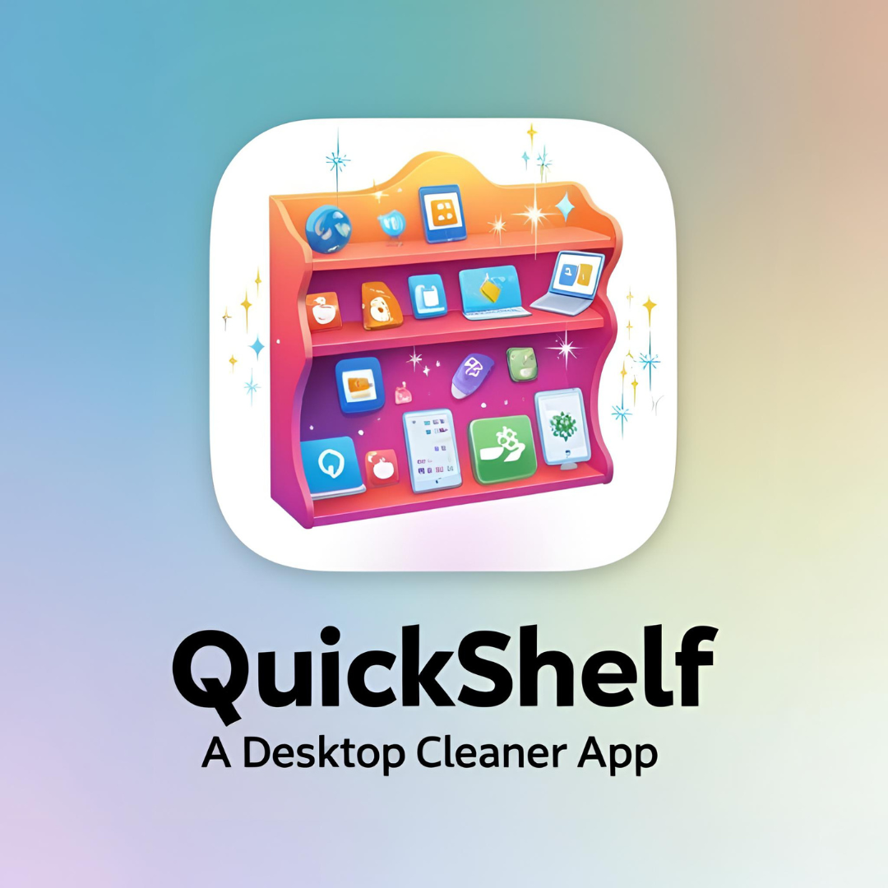

# QuickShelf - Smart Desktop Organizer

 (optional)

A Python-based Mac application that automatically organizes your cluttered desktop by intelligently categorizing files.

## Features
- Automatic file categorization using machine learning
- One-click desktop cleanup
- Visual dashboard of your organization patterns
- Recent files tracking
- Customizable categories

## Installation

### Prerequisites
- macOS 10.15 or later
- Python 3.8+

### Method 1: Using Pre-built App
1. Download the latest release from [Releases Page]
2. Drag QuickShelf.app to your Applications folder
3. Right-click and select "Open" (may be required for first launch)

### Method 2: From Source
```bash
# Clone the repository
git clone https://github.com/yourusername/quickshelf.git
cd quickshelf

# Install dependencies
pip3 install -r requirements.txt

# Build the application
python3 setup.py py2app

# Run the application
open dist/QuickShelf.app
Usage
Launch QuickShelf.app

Click "Scan Desktop" to see how files will be organized

Click "Organize Now" to automatically categorize files

Use "Dashboard" to view your organization patterns

Customization
Edit categories.json to modify default categories:

json
Copy
{
    "Documents": [".pdf", ".docx"],
    "Images": [".jpg", ".png"]
}
Troubleshooting
If you get "App is damaged" error:

bash
Copy
xattr -cr /Applications/QuickShelf.app
License
MIT